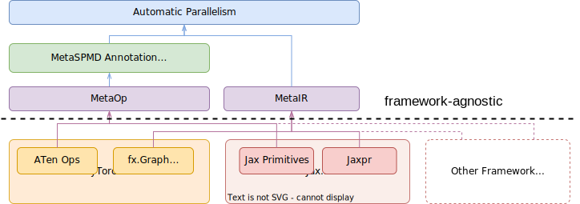

# EasyDist

EasyDist is an automated parallelization system and infrastructure designed for multiple ecosystems, offering the following key features:

- **Usability**. With EasyDist, parallelizing your training or inference code to a larger scale becomes effortless with just a single line of change.

- **Ecological Compatibility**. EasyDist serves as a centralized source of truth for SPMD rules at the operator-level for various machine learning frameworks. Currently, EasyDist currently supports PyTorch, Jax natively, and the TVM Tensor Expression operator for SPMD rules.

- **Infrastructure**. EasyDist decouples auto-parallel algorithms from specific machine learning frameworks and IRs. This design choice allows for the development and benchmarking of different auto-parallel algorithms in a more flexible manner, leveraging the capabilities and abstractions provided by EasyDist.

## One Line of Code for Parallelism

To parallelize your training loop using EasyDist, you can use the `easydist_compile` decorator. Here's an example of how it can be used with PyTorch:

```python
@easydist_compile()
def train_step(net, optimizer, inputs, labels):

    outputs = net(inputs)
    loss = nn.CrossEntropyLoss()(outputs, labels)
    loss.backward()

    optimizer.step()
    optimizer.zero_grad()

    return loss
```

This one-line decorator parallelizes the training step. You can find more examples in the [`./examples/`](./examples/) directory.

## Overview

EasyDist introduces the concept of MetaOp and MetaIR to decouple automatic parallelization methods from specific intermediate representations (IR) and frameworks. Additionally, it presents the ShardCombine Algorithm, which defines operator Single-Program, Multiple-Data (SPMD) sharding rules without requiring manual annotations. The architecture of EasyDist is as follows:

<br><div id="top" align="center">

</div><br>

## Installation

To install EasyDist, you can use pip and install from PyPI:

```shell
# For PyTorch users
pip install pai-easydist[torch]

# For Jax users
pip install pai-easydist[jax] -f https://storage.googleapis.com/jax-releases/jax_cuda_releases.html
```

If you prefer to install EasyDist from source, you can clone the GitHub repository and then install it with the appropriate extras:

```shell
git clone https://github.com/alibaba/easydist.git && cd easydist

# EasyDist with PyTorch installation
pip install -e '.[torch]'

# EasyDist with Jax installation
pip install -e '.[jax]' -f https://storage.googleapis.com/jax-releases/jax_cuda_releases.html
```

## Contributing

See CONTRIBUTING.md for details.

## Contributors

EasyDist is developed by Alibaba Group and NUS HPC-AI Lab. This work is supported by [Alibaba Innovative Research(AIR)](https://damo.alibaba.com/air/).

## License

EasyDist is licensed under the Apache License (Version 2.0). See LICENSE file.
This product contains some third-party testcases under other open source licenses. 
See the NOTICE file for more information.

